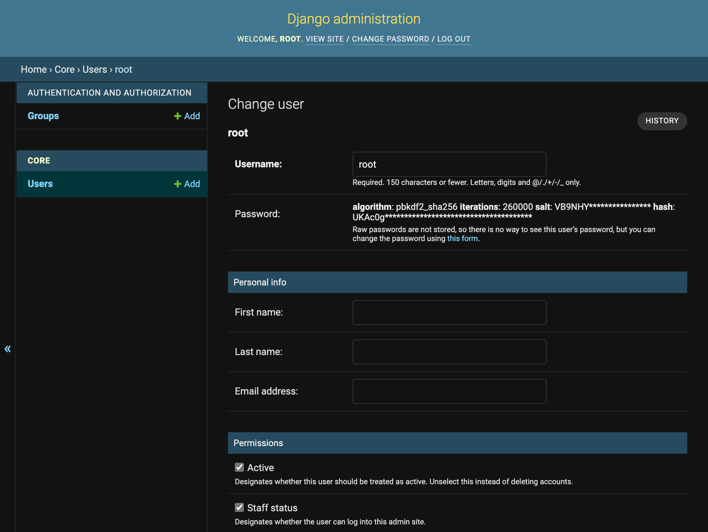

# Dockerise a Django project - Part 1

Setting up a project doesn't have to be painful. Using docker containers in your development environment can have some pretty sweet benefits. Containerising your Django app and its dependencies might take a little longer than some blog posts claim, but we have you covered.

Here is a 7-part series on how we set up and dockerise every new Django project at Webinative.

- Part 1 - Setting up the project
- Part 2 - Adding useful third-party apps
- Part 3 - Abstracting environment variables
- Part 4 - Containerising the application
- Part 5 - Setting up a python debugger
- Part 6 - Setting up a Postgres DB container
- Part 7 - Setting up a Mailhog container

In Part 01, we'll cover how to:

1. [Create a new django project](#create-a-django-project)
1. [Create a new core app within our project](#create-the-core-app)
1. [Customise the project's `User` model](#customise-user-model)
1. [Customise `UserAdmin` for our custom `User` model](#customise-useradmin)

You can skip to **Part 02** if you are not interested in the detailed instructions in the rest of the article. To see how the code will look at the end, clone this [GitHub repository](https://github.com/Webinative/dockerise-django) and checkout the `part_01/init` branch.

## Create a Django project

Let's create our new Django project inside the `~/Dev/dockerise-django` folder.

```sh
# change to $HOME folder
cd ~

# create "Dev" and "dockerise_django" folders
mkdir -p Dev/dockerise-django

# change into our destination folder
cd Dev/dockerise-django
```

Next, we'll create a new virtual environment, install Django and create our project.

```sh
# create a virtual environment named "dockerise_django"
mkvirtualenv dockerise_django

# the virtual environment is activated automatically upon successful creation

# install the latest LTS version of django
pip install django==3.2.16

# create a new django-project named "dockerise_django" in the current folder
# note the trailing dot in the command below
django-admin startproject dockerise_django .
```

**IMPORTANT:** For the rest of the article, run all terminal/shell commands within the virtual environment.

You should now see a folder named `dockerise_django` and a file named `manage.py` created in the current folder.


## Create the core app

Create a new Django app named `core` within our project using the command,

```sh
django-admin startapp core
```

You should now see a folder named `core` created in the current folder.


Open the current folder `~/Dev/dockerise-django/` in your favourite code editor. I'll be using VisualStudio Code.

```sh
# opens the current folder in visual-studio code
code .
```

Open the `dockerise_django/settings.py` file, locate the `INSTALLED_APPS` setting and add the newly created `core` app. This setting installs the core app in our project.

```python
INSTALLED_APPS = [
  ...
  "core",
]
```


## Customise User model

Next, we'll [substitute django's built-in User model](https://docs.djangoproject.com/en/3.2/topics/auth/customizing/#substituting-a-custom-user-model). Though this step is not necessary for dockerising a Django app, it has various benefits in the long run.

Open the `core/models.py` file and add the following lines,

```python
from django.contrib.auth.models import AbstractUser
from django.db import models


class User(AbstractUser):
    """Custom user model for dockerise_django project"""

    class Meta:
        db_table = 'dd_users'

    def __str__(self) -> str:
        return self.username
```

Next, we'll configure our project to use the newly defined `User` model. In the `dockerise_django/settings.py` file, add the following line.

```python
AUTH_USER_MODEL = "core.User"
```

Then, we'll create the database migrations and run them. In your terminal, run the following commands,

```sh
# make migrations
python manage.py makemigrations

# migrate changes to database
python manage.py migrate
```


## First-run

Let's run the app now to ensure our customisations did not break anything unintended. In your terminal, with your virtual environment activated, run the following command,

```sh
python manage.py runserver
```


In your browser, visit `http://localhost:8000/`. You should see a page similar to the screenshot below.


## Customise UserAdmin

We have successfully substituted Django's built-in User model with our User model. To ensure our newly created User model works well with Django's admin panel, we must extend/customise the built-in `UserAdmin` class.

Open the `core/admin.py` file and add the following lines,

```python
from django.contrib import admin
from django.contrib.auth.admin import UserAdmin

from .models import User


@admin.register(User)
class CoreUserAdmin(UserAdmin):
    """Custom UserAdmin for core.User model"""

    list_display = ["username", "is_active", "is_staff", "is_superuser"]
    list_filter = ("is_staff",)
```

Next, we'll create a new `superuser` to login into Django's admin panel and test the CoreUserAdmin configuration.

```sh
# Press Ctrl+C to stop the runserver command

# create superuser
python manage.py createsuperuser

# follow instructions on screen
# for this article, we created a superuser named "root".
```


Run the application,

```sh
python manage.py runserver
```

Open your browser and visit `http://localhost:8000/admin/`. Login with the newly created superuser's credentials.

Admin login page:


Admin home page:


Admin - List users page


Admin - Change user page


In the change user page, next to the password field, you should see a link to the change password form. If you see a text input box instead, your configuration could be incorrect and needs rechecking.

If everything works as intended, then congratulations. You have made it to the end of part 01.

To summarise, we created a new Django project with a core app and custom User model. We implemented a custom UserAdmin. We verified these configurations work together as intended by logging into the Django admin panel.
