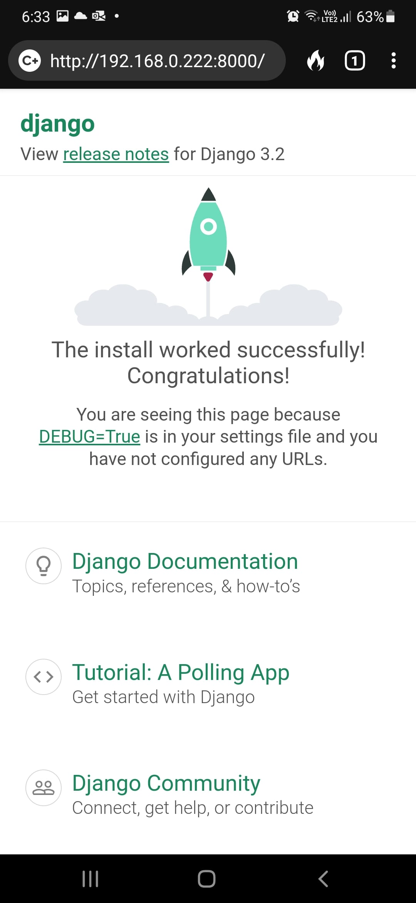

# Dockerise a Django project - Part 2

Welcome to Part 2 of the series on how we set up and dockerise every new Django project at Webinative.

In part 1 of this series, we created a new Django project with a core app and custom User model. We implemented a custom UserAdmin. We also set up a Django superuser to login into the admin panel.

This article will focus on a few useful third-party Django apps and python packages, each providing unique benefits during development and deployment.

1. Allow CIDR - Use local mobile devices for alpha-testing
2. Debug toolbar - A handy in-browser debugger for developers
3. Minify HTML - Client-side optimiser for production environment
4. Flake8 - To enforce coding style
5. Black - To format code consistently

## Using mobile devices for alpha-testing

Often, during development, we'll need to test the app on mobile devices. You can access your computer's development server from your phone/tablet. However, your computer and mobile devices must be on the same network (WiFi or LAN).

To test this, let's figure out the IP address of your computer. In most cases, your internal IP starts with `192`. Get your computer's LAN IP address by running the below command in your terminal.

```sh
# if you are using a mac
ifconfig | grep 192

# if you are using ubuntu linux
ip addr | grep 192

# outputs something like
#   inet 192.168.0.222 netmask 0xffffff00 broadcast 192.168.0.255

# Here 192.168.0.222 is my computer's LAN IP address.
```


Next, we'll run the dev server on this IP instead of localhost (`127.0.0.1`).


Now try accessing this dev server at `http://192.168.0.222:8000/` from your phone/tablet's browser.

You'll see an error message similar to the screenshot below,


The error message also suggests a solution.

> You may need to add '192.168.0.222' to your ALLOWED_HOSTS.

In your code editor, open the `dockerise_django/settings.py` file and change the `ALLOWED_HOSTS` setting as shown below.

```python
ALLOWED_HOSTS = [
  '192.168.0.222'
]
```

Save the file and wait for the development server to restart.

Then, refresh your mobile browser. You should now see the home page.



However, there is still a problem with this approach. You won't be the only person working on this project, and your computer won't be the only development environment. Hardcoding your local IP address into the project's settings might not work for other developers, and vice-versa.

We will solve this problem in two steps.

First, we'll run the dev server in `0.0.0.0:8000` instead of a fixed local IP.


Next, we'll configure our Django project to allow any local IP starting with `192.168.XXX.XXX`. Luckily, we have a tried-and-tested third-party Django app named **[django-allow-cidr](https://pypi.org/project/django-allow-cidr/)** to do this.

### Install django-allow-cidr

In your terminal, with your virtual environment activated, install the pip package.

```sh
pip install django-allow-cidr
```

Then, modify your `dockerise_django/settings.py` file as shown below.

```python
# step 1: add localhost to allowed-hosts
ALLOWED_HOSTS = [
  "localhost",
]

# step 2: define the CIDR range
if DEBUG:
  # enable CIDRs only in debug mode
  ALLOWED_CIDR_NETS = ['192.168.0.0/24']

# step 3: add the middleware
MIDDLEWARE = [
  'allow_cidr.middleware.AllowCIDRMiddleware',
  # other middleware classes
]
```

#### Notes

1. CIDR value should be specified considering your network. If your local IP starts with `192.168.1.XXX`, you will have to use `192.168.1.0/24`.
1. If your team is spread across `192.168.2.XXX`, `192.168.3.XXX` and so on, then consider adding those subnets to the list.
1. The newly added middleware should be the first on the list.

Save the file and wait for the server to restart. Refresh your mobile browser and you should still see the home page.

Source: [django-allow-cidr](https://pypi.org/project/django-allow-cidr/)

## Debugging requests and responses

As web application developers, our work revolves around requests and responses. Django Debug Toolbar is a handy set of panels displayed in-browser that provide various debug information about the current request/response. The toolbar includes information about the executed SQL queries, loaded template folders, rendered templates, served static files and so on.

### Install django-debug-toolbar

In your terminal, with your virtual environment activated, install the pip package.

```sh
pip install django-debug-toolbar
```

Check for prerequisites,

1. Ensure the static files app is installed and configured in our project.
2. Ensure our project uses the `DjangoTemplates` backend and has app directories enabled.

Check the contents of the `dockerise_django/settings.py` file,

```python
INSTALLED_APPS = [
  # ...
  'django.contrib.staticfiles',
  # ...
]

STATIC_URL = '/static/'

TEMPLATES = [
  {
    "BACKEND": "django.template.backends.django.DjangoTemplates",
    "APP_DIRS": True,
    # ...
  }
]
```

Once you have verified the prerequisites, modify your project settings as described below,

1. Install `debug_toolbar`
1. Add the middleware
1. Configure internal-IPs

```python
# step 1: install the app
INSTALLED_APPS = [
  # ...
  "debug_toolbar",
  # ...
  "core"
]

# step 2: add the middleware
MIDDLEWARE = [
    # ...
    "debug_toolbar.middleware.DebugToolbarMiddleware",
]

# step 3: add the internal-ips setting
if DEBUG:
  ALLOWED_CIDR_NETS = ['192.168.0.0/24']
  # set debug-toolbar to be visible only in localhost
  INTERNAL_IPS = [
      "127.0.0.1",
  ]
```

It is good practice to include Django's built-in apps first, then third-party apps and the project-specific apps in the `INSTALLED_APPS` setting.

The debug-toolbar middleware must come after any other middleware that encodes the response content, such as `GZipMiddleware`.

Next, add the toolbar's URLs to our project's URL config file `dockerise_django/urls.py`.

```python
from django.urls import include, path

urlpatterns = [
    # ...
    path("__debug__/", include('debug_toolbar.urls')),
]
```

Now, if you refresh the browser, you might see Page not found (404). Implementing a view to handle the `/` route should fix this (which we will do later).

Notice a debug toolbar displayed to the right of the browser window. See the screenshot below.


However, this toolbar won't be visible on your mobile browsers because of the `INTERNAL_IPS` setting.

Explore each panel and familiarise to know where to look for information when debugging.

Source: [django-debug-toolbar](https://pypi.org/project/django-debug-toolbar/)

## Minify HTML code

> One of the important points on client side optimisation is to minify HTML. With minified HTML code, you reduce the size of the data transferred from the server to the client, which results in faster load times.

Unlike the previous two apps, minifying our HTML code is an optimisation for production environment. Installing and configuring this at the time of project setup saves us time later on.

### Install django-htmlmin

In your terminal, run the following command with your virtual environment activated.

```sh
pip install django-htmlmin
```

Modify the project settings,

```python
MIDDLEWARE = [
  # ...
  "htmlmin.middleware.HtmlMinifyMiddleware",
  "htmlmin.middleware.MarkRequestMiddleware",
  "debug_toolbar.middleware.DebugToolbarMiddleware",
]
```

Note that if you're using Django's caching middleware, `MarkRequestMiddleware` should go after `FetchFromCacheMiddleware`, and `HtmlMinifyMiddleware` should go after `UpdateCacheMiddleware`.

```python
MIDDLEWARE = [
    'django.middleware.cache.UpdateCacheMiddleware',
    'htmlmin.middleware.HtmlMinifyMiddleware',
    # ...
    'django.middleware.cache.FetchFromCacheMiddleware',
    'htmlmin.middleware.MarkRequestMiddleware',
]
```

The default behaviour of the middleware is to remove all HTML comments. If you prefer keeping the comments, define an additional setting,

```python
KEEP_COMMENTS_ON_MINIFYING = True
```

Source: [django-htmlmin](https://pypi.org/project/django-htmlmin/)

## Enforce coding style

Every project must have preset coding conventions, and developers must adhere to them. But, there is always a possibility for human error. That's why we use a linting tool like Flake8.

Flake8 is a tool to check python code and enforce style guides. It is a wrapper around three different tools, namely

1. `pyflakes` - to examine the syntax tree
1. `pycodestyle` - to check python code against PEP8 code conventions
1. `mccabe` - to check the complexity of python code

To install flake8, use the command,

```sh
pip install flake8
```

To enable flake8 in the Visual Studio Code editor, press `Ctrl + Shift + P` or `Cmd + Shift + P` to bring up the command prompt, then type `Python: Select Linter` and hit enter.


You should see a list of linters. Select `flake8`.


_**Note**_: Install the VS Code [Python extension](https://marketplace.visualstudio.com/items?itemName=ms-python.python) if not done already.

To see flake8 in action, open the `settings.py` file.

Look at the errors section in the status bar at the bottom left corner of the window.


Click on the errors section to bring up the "Problems" panel.


The maximum line-length by default is 79 characters. Flake8 highlights all lines that have exceeded this limit. Let us configure Flake8 to respect Django's guideline of 119 characters.

Create a new file named `setup.cfg` in the project root with the following content,

```ini
[flake8]
exclude=.git,*migrations*
max-line-length=119
```

We have also excluded the `git` and `migrations` folders from the flake8 check.

Save the file. Close and reopen `settings.py`. You should now see no errors in the _Problems_ panel.

## Formatting code

_Flake8_ checks your code against the PEP8 style guide and reports errors. The _Black_ formatter fixes them.

To install black, use the command

```sh
pip install black
```

To enable _black_ in Visual Studio Code editor, press `Ctrl + ,` or `Cmd + ,` to bring up the settings page.

Switch to the **Workspace** settings tab, then search for "python format". Locate the **Python > Formatting: Provider** setting and change it to _black_.


We'll see how the black formatter works as we make more code changes in the upcoming parts.

So, summarising, we added three third-party Django apps, a linter, and a code formatter and integrated them with Visual Studio Code.
