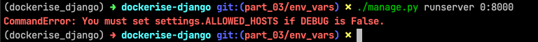
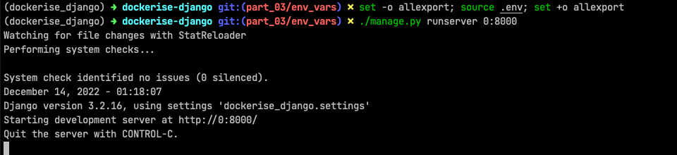

# Dockerise a Django project - Part 3

Welcome to Part 3 of the series on how we set up and dockerise every new Django project at Webinative.

In part 1, we created a new Django project with a core app and custom User model.

In part 2, we added some useful third-party Django apps and python packages to our project.

This article will focus on abstracting some key configurations into environment variables.

## Why use environment variables

A Django project could be run in one or more of the following environments,

- Alpha   (Development)
- Beta    (Quality assurance)
- Staging (Pre-Production)
- Live    (Production)

Some of the project's configurations/settings change depending on the runtime environment. For example, consider the `ALLOWED_HOSTS` and `DEBUG` settings.

| Setting | Alpha | Beta | Staging | Live |
| --- | --- | --- | --- | --- |
| `ALLOWED_HOSTS` | `localhost` | `beta.myproject.com` | `staging.myproject.com` | `myproject.com` |
| `DEBUG` | `True` | `True` | `False` | `False` |

Moreover, it is good practice to have a unique `SECRET_KEY` for every environment.

The old-school approach is to have multiple `settings.py` files one for each environment like `settings_alpha.py`, `settings_beta.py`, etc. But saving your secrets in Git or any VCS is not recommended (see [12-factor principles](https://12factor.net/)). A better approach is to use environment variables.

## Abstract ENV variables

Create a `.env` file within your project root (same level as `manage.py`). Note that any file or folder that starts with a dot is hidden in Linux and Mac.

We'll identify the config that could change with environment and move them into this file.

```ini
# contents of .env

DJANGO_ALLOWED_CIDR_NETS=192.168.0.0/24
DJANGO_ALLOWED_HOSTS=localhost
DJANGO_DEBUG=True
DJANGO_INTERNAL_IPS=127.0.0.1
DJANGO_TIME_ZONE=UTC
DJANGO_SECRET_KEY="django-insecure-q-*lrcfa-ll41wh@9=l+f=96%!9%vpm8h)jdw)gpw7)i41c94k"
```

Note that all keys have a prefix `DJANGO_` acting as a namespace.

Next, we'll update `settings.py` to read these values from the environment.

```python
import os

SECRET_KEY = os.getenv('DJANGO_SECRET_KEY')

DEBUG = os.getenv('DJANGO_DEBUG')

ALLOWED_HOSTS = []
ALLOWED_HOSTS_ENV = os.getenv('DJANGO_ALLOWED_HOSTS')
if ALLOWED_HOSTS_ENV:
    ALLOWED_HOSTS = ALLOWED_HOSTS_ENV.split(',')

if DEBUG:
    ALLOWED_CIDR_NETS_ENV = os.getenv('DJANGO_ALLOWED_CIDR_NETS')
    if ALLOWED_CIDR_NETS_ENV:
        ALLOWED_CIDR_NETS = ALLOWED_CIDR_NETS_ENV.split(',')

    INTERNAL_IPS_ENV = os.getenv('DJANGO_INTERNAL_IPS')
    if INTERNAL_IPS_ENV:
        INTERNAL_IPS = INTERNAL_IPS_ENV.split(',')

# ...

TIME_ZONE = os.getenv('DJANGO_TIME_ZONE', 'UTC')
```

Adding `.env` file in our project's `.gitignore` ensures Git doesn't track this file.

Now, try running the development server.

```sh
# within your project folder

workon dockerise_django

./manage.py runserver 0:8000
```

You should see an error as shown below,



The reason is we have abstracted some settings into a `.env` file but we have not loaded those values into our virtual environment.

### Load ENV variables

Let us load the contents of `.env` file into our virtual environment, and then run the development server.

```sh
# load contents of .env file
set -o allexport; source .env; set +o allexport

# runserver
./manage.py runserver 0:8000
```



The development server now runs without errors.

**Tip:** You can use the `postactivate` hook to load the `.env` file every time the virtual environment is activated.

Add the following lines to the `$WORKON_HOME/dockerise_django/bin/postactivate` file.

```sh
set -o allexport; source $HOME/Dev/dockerise-django/.env; set +o allexport
```

You can test the `postactivate` hook using the following commands,

```sh
deactivate

workon dockerise_django

echo $DJANGO_ALLOWED_HOSTS
# should print localhost

./manage.py runserver 0:8000
# should run the dev server without any errors
```

Going forward, as you add more apps and configurations in your project, remember to identify and abstract configuration that might vary with environments into the `.env` file.

In the next part, we will start containerising the application.
