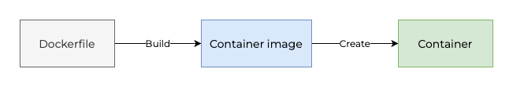
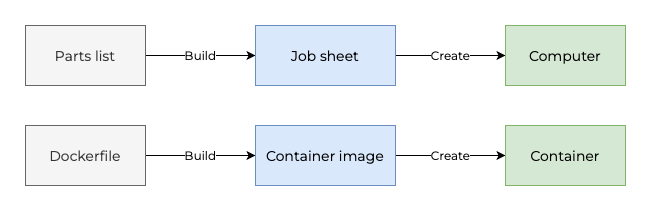
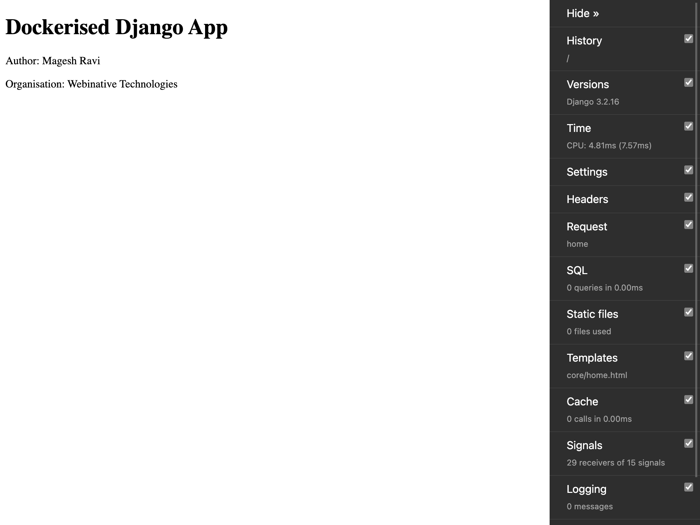
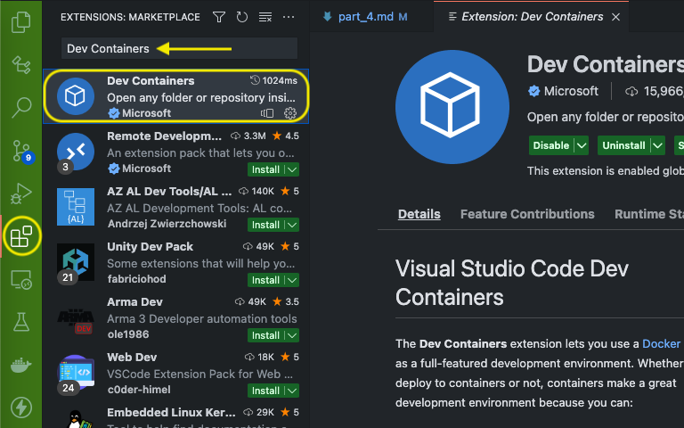
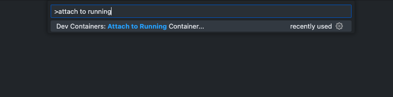
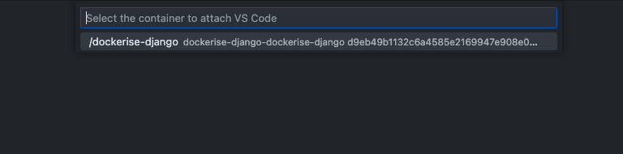
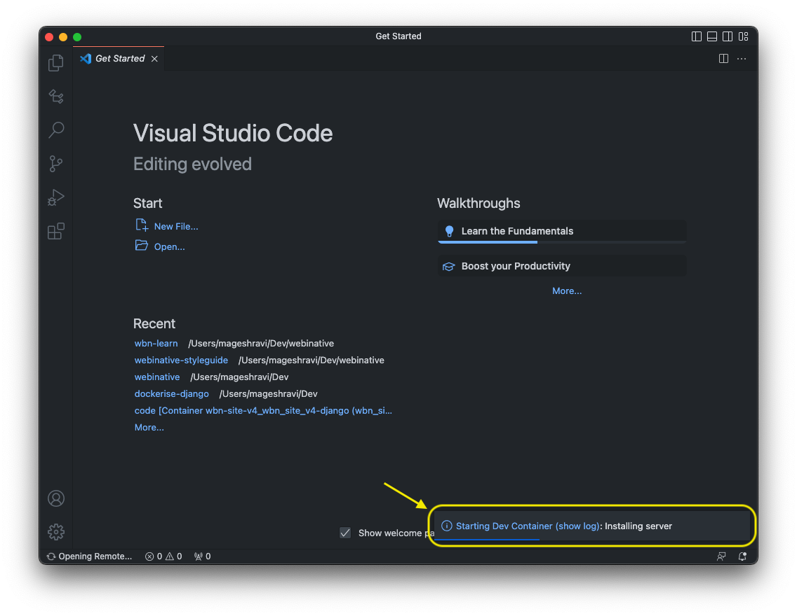
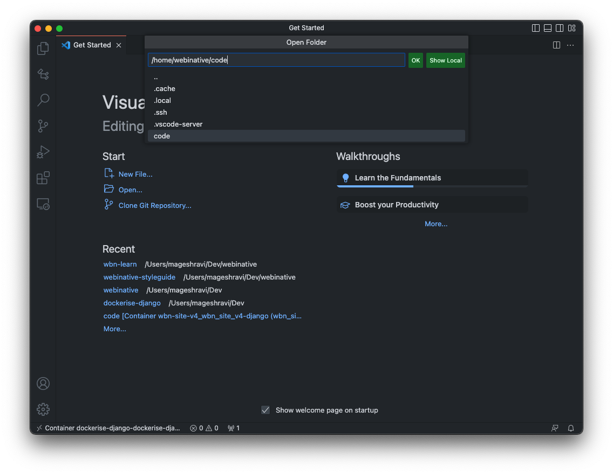
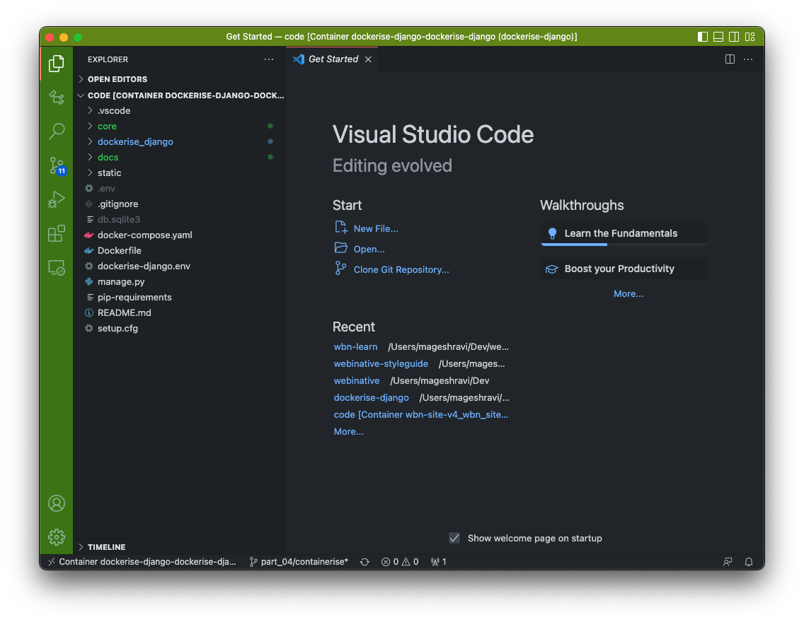
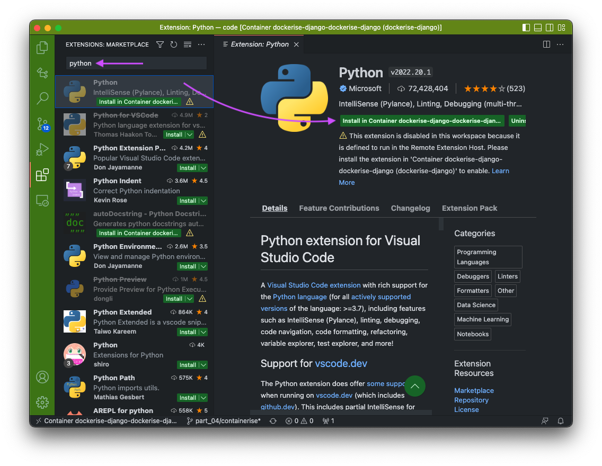

# Dockerise a Django project - Part 4

Welcome back. Here we are at part 4 of the series on how we dockerise every Django project at Webinative.

Here's a quick recap.

Part 1: Created a Django project with a core app and custom User model.

Part 2: Added some must-have third-party Django apps and python packages to our project.

Part 3: Abstracted deployment-specific configurations into environment variables.

We now have a Django application running inside a python virtual environment. This article will focus on containerisation using Docker and Docker-Compose.

## Terminology

### Container

A container is just like any other software/application running on your computer. However, the key difference from a regular application is how a containerised application packages all code, dependencies, runtime, system libraries and settings into a standalone unit.

### Container image

A container image is a static file with executable code that can create a container. In other words, container images become containers when they run on the Docker Engine.

### Dockerfile

Docker can build images automatically by reading the instructions from a `Dockerfile`. A `Dockerfile` is a text document that contains all the commands a user could call on the command line to assemble an image.



### Analogy

Imagine yourself assembling a PC.

1. You'd start with the expectations &mdash; why do you need this PC? For gaming, business, media production, coding or all the above?
2. Then, you pick suitable parts &mdash; CPU, RAM, graphics, storage, etc.
3. Once you finalise the parts list, you place an order with your local computer store.
4. A staff member at the store bills your parts and puts together a job sheet.
5. A technician at the store starts assembling your PC based on the job sheet.
6. Finally, you walk away happy with a brand-new PC.

Your PC is the **container** &mdash; it has everything it needs to run within a self-contained unit.

The local store is the **Docker Engine**.

The job-sheet at the local store is the **container image**.

Your parts-list is the **Dockerfile** &mdash; the instructions to build your container image.



## Django container image

Let's start by defining the `Dockerfile` for our Django application. See the final version below. We will go through the sections one by one and understand them.

```Dockerfile
FROM python:3.10-slim-bullseye
ENV PYTHONBUFFERED 1

ARG USERNAME=webinative
# replace with your actual UID and GID if not the default 1000
ARG USER_UID=1000
ARG USER_GID=${USER_UID}

# create user
RUN groupadd --gid $USER_GID ${USERNAME} \
    && useradd --uid ${USER_UID} --gid ${USER_GID} -m ${USERNAME} \
    # create a folder for vscode editor stuff
    && mkdir -p /home/${USERNAME}/.vscode-server \
    && chown ${USER_UID}:${USER_GID} /home/${USERNAME}/.vscode-server \
    # create a folder for project code
    && mkdir -p /home/${USERNAME}/code \
    && chown ${USER_UID}:${USER_GID} /home/${USERNAME}/code \
    # add sudo support
    && apt-get update && apt-get install -y sudo \
    && echo ${USERNAME} ALL=\(root\) NOPASSWD:ALL > /etc/sudoers.d/${USERNAME} \
    && chmod 0440 /etc/sudoers.d/${USERNAME}

# install git and psycopg2 dependencies
RUN apt-get install -y git gcc libpq-dev

USER ${USERNAME}
WORKDIR /home/${USERNAME}/code
ADD pip-requirements /home/${USERNAME}/code/

# install python packages locally for user "webinative"
RUN pip install -r pip-requirements

# remove psycopg2 dependencies
RUN sudo apt-get remove -y gcc libpq-dev

# not switching back to "root" user
```

So, what does this file do?

### Base python image

We start with a base python image. How to decide which image/version to use?

1. Start with your **production environment** &mdash; where you would deploy the application for your end users. In our case, we will use the most recent Ubuntu LTS 22.04 Jammy Jellyfish version.

2. Then figure out the **default python version** that's bundled in the server OS. In our case, it is Python v3.10.2 (See Jammy Jellyfish [realease notes](https://discourse.ubuntu.com/t/jammy-jellyfish-release-notes/)).

3. Finally, pick an **official python image** from the [Docker Hub](https://hub.docker.com/_/python/).

Ubuntu 22.04 LTS is [based on](https://askubuntu.com/questions/445487/what-debian-version-are-the-different-ubuntu-versions-based-on) Debian Bookworm. But as of this writing, there are NO python images for Bookworm. So, we will use the version based on the previous Debian release &mdash; Bullseye. In addition, we will use the [slimmer version](https://medium.com/swlh/alpine-slim-stretch-buster-jessie-bullseye-bookworm-what-are-the-differences-in-docker-62171ed4531d) to keep the container image size minimal.

```Dockerfile
FROM python:3.10-slim-bullseye
```

### Code & file permissions

Our host OS and the container share our project's code. You'll edit the code on your code editor (running on the host OS) while the application runs within the container.

Any code generated within your container should be readable/writable on your host OS and vice-versa. If not, you will encounter permission issues (when creating apps, migrations,  translation files, handling file uploads and much more).

To ensure this, we will,

1. Create a new user "`webinative`" within the container with UID and GID the same as our host OS user account.
2. Place our project's code within the "`/home/webinative/code`" folder and ensure ownership.

Find your UID and GID by running the following command in the terminal,

```sh
id

# outputs something like
# uid=1000(magesh) gid=1000(magesh) groups=...
```

In the example above, my UID is 1000, and my GID is 1000.

We create a new Linux user named `webinative` with the same UID and GID obtained from the previous step.

```Dockerfile
ARG USERNAME=webinative
# replace with your actual UID and GID if not the default 1000
ARG USER_UID=1000
ARG USER_GID=${USER_UID}

# create user
RUN groupadd --gid $USER_GID ${USERNAME} \
    && useradd --uid ${USER_UID} --gid ${USER_GID} -m ${USERNAME} \
    # create a folder for vscode editor stuff
    && mkdir -p /home/${USERNAME}/.vscode-server \
    && chown ${USER_UID}:${USER_GID} /home/${USERNAME}/.vscode-server \
    # create a folder for project code
    && mkdir -p /home/${USERNAME}/code \
    && chown ${USER_UID}:${USER_GID} /home/${USERNAME}/code \
    # add sudo support
    && apt-get update && apt-get install -y sudo \
    && echo ${USERNAME} ALL=\(root\) NOPASSWD:ALL > /etc/sudoers.d/${USERNAME} \
    && chmod 0440 /etc/sudoers.d/${USERNAME}
```

### Dependencies

Next, we will configure the following instructions for the container,

1. **Install Git** so that the VS Code editor attached to the container can see the changes.
1. **Install psycopg2 dependencies** so that our Django project can work with the PostgreSQL database (later).
1. Set our **current user** as `webinative`.
1. Set our **working directory** as `/home/webinative/code/`.
1. Copy the `pip-requirements` file into our working directory and **install project dependencies**.
1. Remove packages that are no longer required.

```Dockerfile
# install git and psycopg2 dependencies
RUN apt-get install -y git gcc libpq-dev

USER ${USERNAME}
WORKDIR /home/${USERNAME}/code
ADD pip-requirements /home/${USERNAME}/code/

# install python packages locally for user "webinative"
RUN pip install -r pip-requirements

# remove psycopg2 dependencies
RUN sudo apt-get remove -y gcc libpq-dev
```

## Runtime configuration using Compose

We have the instructions to build our container image in the `Dockerfile`. However, we'll have to specify more configurations when running the container, such as,

1. Which command/process should the container run?
1. Which user should run the command inside the container?
1. Which folders require sharing between the host and container (as volumes)?
1. Which ENV vars does the container's environment require?
1. Any port mapping between the host and the container?

We could specify these configurations in our command-line while running the container. However, the command could quickly become too big to type manually and difficult to maintain.

To simplify the runtime command, we will use [Docker Compose](https://docs.docker.com/compose/compose-file/).

> Compose is a tool for defining and running multi-container Docker applications. With Compose, you use a YAML file to configure your application's services. Then, with a single command, you create and start all the services from your configuration.

Here's our `docker-compose.yml` file,

```yaml
version: '3'

services:
    dockerise-django:
        build: .
        user: webinative
        command: python -u manage.py runserver 0:8000
        container_name: dockerise-django
        env_file:
            - ./dockerise-django.env
            - ./.env
        volumes:
            - .:/home/webinative/code
            - dockerise-django-vscode:/home/webinative/.vscode-server
        ports:
            - "8000:8000"
        restart: on-failure

volumes:
    dockerise-django-vscode:
```

Let's go through the options one by one.

### `services`

Every component in our application that can be scaled/replaced independently is a service. Simply put, every service is a container. Other examples of services are a Postgres database, a RabbitMQ server, an SMTP client, etc.

In our case, the Django application is a service. We name it `dockerise-django`

### `build`

Specifies where to look for the `Dockerfile` when building the container image.

Our target `Dockerfile` is in the current folder. Hence, the single dot.

### `user`

Specify the `user` that will run the container's `command`. Otherwise, the container's `root` user runs the command.

We'll use the `webinative` user account to run the Django development server.

### `command`

The command that the container executes. The container runs as long as the command. Upon successful completion or on error, the container stops.

Our Django container runs the development server command,

```sh
python -u manage.py runserver 0:8000
```

The additional argument `-u` forces the stdout and stderr streams to be unbuffered so that you view the application logs in real-time during development.

### `container_name`

Specify a custom container name instead of a default generated name. We use `dockerise-django`.

### `env_file`

File(s) containing environment variables for the container.

Let's take a look at our `.env` file.

```ini
DJANGO_ALLOWED_CIDR_NETS=192.168.0.0/24
DJANGO_ALLOWED_HOSTS=localhost
DJANGO_DEBUG=True
DJANGO_INTERNAL_IPS=127.0.0.1
DJANGO_TIME_ZONE=UTC
DJANGO_SECRET_KEY="django-insecure-q-*lrcfa-ll41wh@9=l+f=96%!9%vpm8h)jdw)gpw7)i41c94k"
```

Of these ENV vars, only the `DJANGO_ALLOWED_CIDR_NETS` value changes from developer to developer depending on their location and local network settings. All other values remain the same (for the development environment).

Let's move the other ENV vars into a new file named `dockerise-django.env`. Git will track this new file and make it available to all team members.

```ini
# contents of dockerise-django.env
DJANGO_ALLOWED_HOSTS=localhost
DJANGO_DEBUG=True
DJANGO_INTERNAL_IPS=127.0.0.1
DJANGO_TIME_ZONE=UTC
DJANGO_SECRET_KEY="django-insecure-q-*lrcfa-ll41wh@9=l+f=96%!9%vpm8h)jdw)gpw7)i41c94k"
```

```ini
# contents of .env
DJANGO_ALLOWED_CIDR_NETS=192.168.0.0/24
```

We'll include both `env` files in our container.

```yaml
env_file:
    - ./dockerise-django.env
    - ./.env
```

### `volumes`

Specify mapping between a host folder and a container folder.

```yaml
version: '3'

services:
    dockerise-django:
        ...
        volumes:
            - .:/home/webinative/code
            - dockerise-django-vscode:/home/webinative/.vscode-server

volumes:
    dockerise-django-vscode:
```

We share our code (current folder) with the `/home/webinative/code` folder within the container.

We will use **Visual Studio Code** with [Dev containers](https://marketplace.visualstudio.com/items?itemName=ms-vscode-remote.remote-containers) extension. We provision a named volume `dockerise-django-vscode` to store all the `vscode-server` stuff. With this config, all binaries, extensions and cache that VS Code needs are NOT lost when containers are re-provisioned (destroyed and run again).

We also define the named volume as a top-level declaration at the end of the YAML file.

### `ports`

Specify the mapping between a host port and a container port.

```yaml
ports:
    - "8000:8000"
```

Our Django development server runs within the container on port 8000. We map that port to our host machine's 8000 port for our browser to send and receive traffic.

> Note: Ensure no other applications run on your host machine's 8000 port.

### `restart`

Our container stops every time our application raises an unhandled exception. During development, errors are unavoidable, and we do not want to start the container manually every time. We can configure our container to restart automatically upon encountering unhandled exceptions.

## Build container image

We now have the instructions ready to build our container image. Let's test them.

In your terminal, run,

```sh
docker-compose build
```

The command usually takes about a minute to complete the first time.


Next, verify the built docker-image using the command,

```sh
docker image ls | grep dockerise-django
```

You should see it listed as shown below.


## Run the container

Next, we'll run the container from the built image.

In your terminal, run,

```sh
docker-compose up
```


Open your web browser and visit `http://localhost:8000/`. You should see a screen as shown below.


Notice that we no longer see the debug toolbar in our browser. We'll have to reconfigure the debug-toolbar to work with our docker setup.

Replace the `INTERNAL_IPS` setting in the `settings.py` file, as shown below.

```python
if DEBUG:
    ALLOWED_CIDR_NETS_ENV = os.getenv("DJANGO_ALLOWED_CIDR_NETS")
    if ALLOWED_CIDR_NETS_ENV:
        ALLOWED_CIDR_NETS = ALLOWED_CIDR_NETS_ENV.split(",")

    import socket

    hostname, _, ips = socket.gethostbyname_ex(socket.gethostname())
    INTERNAL_IPS = [ip[: ip.rfind(".")] + ".1" for ip in ips] + [
        "127.0.0.1",
        "10.0.2.2",
    ]
```

The new configuration makes the `DJANGO_INTERNAL_IPS` environment variable obsolete. Delete it from the `dockerise-django.env` file.

In your terminal, press Ctrl + C to stop the running container. Recreate the container with the updated env file using the command,

```sh
docker-compose up
```


Refresh your browser, and you should see the debug-toolbar appearing again.

> **Congratulations**
>
> Your django application is now running inside a container.

Some useful commands that might come in handy,

```sh
# run the containers in background mode
docker-compose up -d

# stop the containers
docker-compose stop

# start the containers
docker-compose start

# destroy the containers
docker-compose down
```

## Remove the virtual environment

We have now containerised our Django application. We won't require the python virtual environment we created in the first part of this series anymore.

You can safely remove it using the following commands,

```sh
deactivate

rmvirtualenv dockerise_django
```

## Implement a simple page

Let's remove the 404 error page by adding a new view, template and URL config.

```html
<!-- contents of core/templates/core/home.html -->

<!DOCTYPE html>
<html lang="en">
<head>
    <meta charset="UTF-8">
    <meta http-equiv="X-UA-Compatible" content="IE=edge">
    <meta name="viewport" content="width=device-width, initial-scale=1.0">
    <title>Home | Dockerised Django App</title>
</head>
<body>
    <h1>Dockerised Django App</h1>
    <p>Author: Magesh Ravi</p>
    <p>Organisation: Webinative Technologies</p>
</body>
</html>
```

```python
# contents of core/views.py

from django.shortcuts import render


def home(request):
    return render(request, "core/home.html")
```

```python
# contents of core/urls.py

from django.urls import path

from .views import home

app_name = "core"
urlpatterns = [path("", home, name="home")]
```

```python
# update dockerise_django/urls.py

urlpatterns = [
    path("", include("core.urls", namespace="core")),   # add this line
    path("admin/", admin.site.urls),
    path("__debug__/", include("debug_toolbar.urls")),
]
```

Visit `http://localhost:8000/` in your browser, and you should see a page as shown below.



## Attaching VS Code to the container

You might notice that VS Code's Intellisense (code-completion) has stopped working with python files (`views.py` and `urls.py`). That's because we have moved the project's python runtime from the virtual environment to the container, and our code editor does not know about this change.

We must connect VS Code to the python binaries inside the container for the code-completion to work again.

**[Dev Containers](https://marketplace.visualstudio.com/items?itemName=ms-vscode-remote.remote-containers)** is a VS Code extension that does exactly this. Install it from the extensions view.



Once installed, connect VS Code to your container by pressing `Ctrl + Shift + P` and search for "Dev Containers: Attach to Running Container..." and hit Enter.



You should then see a list of running containers to choose. Pick `dockerise-django`.



You should see a new VS Code window open up.



Go to _**File**_ > _**Open Folder**_, browse `/home/webinative/code/` and click OK.



You should see the complete folder contents in your sidebar.



Next, install the Python extension inside the container.



Once you have installed the python extension, you should see code completions working as expected in python files.

## Finishing up

To summarise, in this post, we have successfully

1. created a docker-image from our `Dockerfile`.
1. created a docker container from our docker-image and the runtime config file `docker-compose.yaml`.
1. connected Visual Studio Code to the Python runtime within our docker container.

All changes described in this post have been committed to the GitHub branch `part_04/containerise` of [this repository](https://github.com/Webinative/dockerise-django).

Like this article? Have a comment to share or a question to raise? Join our [Discord channel](https://discord.gg/DfwgnNHd4k).
