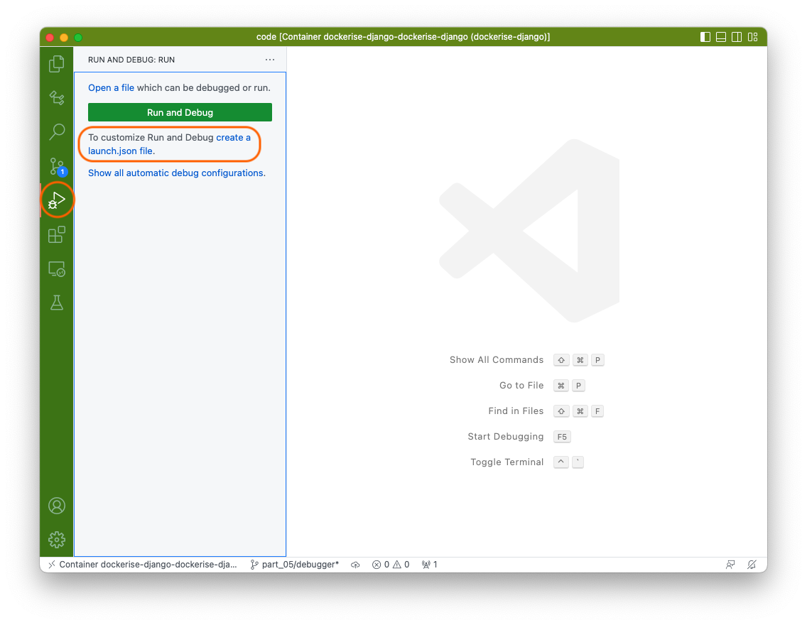

# Dockerise a Django application - Part 5

Welcome to part 5 of the series on how we dockerise Django projects at Webinative.

In the previous four parts, we covered how to set up a new Django project, add some useful third-party apps, abstract environment variables and finally containerise the application.

In this article, we will install a debug server within our container and configure VS Code to listen for breakpoints.

## Install debugpy

Attach to the container's shell using the command,

```sh
docker-compose exec dockerise-django bash
```

Once inside the container's shell, install the `debugpy` package.

```sh
pip install debugpy
```

Update the `pip-requirements` file for rebuilding the docker image later.

```sh
pip freeze > pip-requirements
```

## Start debugpy server

Modify the `manage.py` file to start the debug server alongside the development-server.

```python
from django.conf import settings

def main():
    """Run administrative tasks."""
    os.environ.setdefault("DJANGO_SETTINGS_MODULE", "singalong.settings")

    # ... add the below lines
    if settings.DEBUG:
        if os.getenv("RUN_MAIN") or os.getenv("WERKZEUG_RUN_MAIN"):
            import debugpy

            debugpy.listen(("0.0.0.0", 3000))
            # debugpy.wait_for_client()
            print("Debugpy attached!")

    # ...
```

Update the `docker-compose.yaml` file to expose the debug server's port.

```yaml
version: '3'

services:
  dockerise-django:
    # ...
    ports:
      - "8000:8000"
      - "3000:3000"
    # ...
```

Open a new terminal window (not attached to the container) and run the following commands to rebuild the docker image and recreate the container.

```sh
# rebuild docker image
docker-compose build

# recreate the container
docker-compose up -d
```

## Configure VS Code

In your _remote_ VS Code window, locate the `Run and Debug` icon on the left-hand side activity bar. Clicking on it will open the Debug panel.



Click on the `create a launch.json file.` link, then select `Python`.


In the next prompt, select `Django` or `Remote Attach`.


The above step creates a new file `.vscode/launch.json` in your project's base folder. Update the contents of the file as shown below.

```json
{
    // Use IntelliSense to learn about possible attributes.
    // Hover to view descriptions of existing attributes.
    // For more information, visit: https://go.microsoft.com/fwlink/?linkid=830387
    "version": "0.2.0",
    "configurations": [
        {
            "name": "Python: Remote Attach",
            "type": "python",
            "request": "attach",
            "connect": {
                "host": "localhost",
                "port": 3000
            },
            "pathMappings": [
                {
                    "localRoot": "${workspaceFolder}",
                    "remoteRoot": "/home/webinative/code"
                }
            ],
            "justMyCode": true
        }
    ]
}
```

## Testing the debugger

We have started the debug server and configured VS Code to listen to the target port.

It's time to test our debugging setup.

Open your `core/views.py` file and update the `home` function as shown below,

```python
def home(request):
    a = 1
    b = 10
    print(a + b)
    return render(request, "core/home.html")
```

Add a **breakpoint** in the line defining variable `b`. You can do this by clicking to the left of the line number. Once you add a breakpoint, you should see a red dot appear.


Press `F5` on your keyboard for the VS Code debugger to start listening on port 3000. Once attached and listening, your VS Code window's status bar should turn red, as shown below.


Next, open your browser and visit `http://localhost:8000/`. Your VS Code window should automatically steal your focus and take you to the breakpoint.


That's it. Happy debugging.

## Finishing up

In this article, we have successfully

1. install `debugpy` package
2. configured debug server to start and run on port 3000
3. configured VS Code to attach to the debug server running inside the container
4. tested the setup with a breakpoint

All changes described in this article have been committed to the GitHub branch `part_05/debugger` of [this repository](https://github.com/Webinative/dockerise-django).

Like this article? Have a comment to share or a question to raise? Join our [Discord server](https://discord.gg/DfwgnNHd4k).
