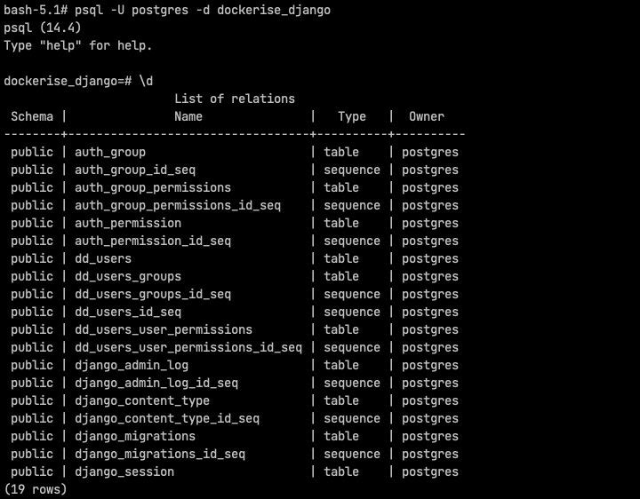

# Dockerise a Django application - Part 6

Welcome to part 6 of the series on how we dockerise Django projects at Webinative.

In this article, we will create a new Postgres container, configure our Django application to connect and use the newly created Postgres DB instead of the default SQLite DB.

## Create a postgres service

In your `docker-compose.yaml` file, create a new service for Postgres.

```yml
version: '3'

services:
  dockerise-postgres:
    image: postgres:14.4-alpine
    container_name: dockerise-postgres
    volumes:
      - dockerise-postgres-data:/var/lib/postgresql/data
    environment:
      POSTGRES_USER: postgres
      POSTGRES_PASSWORD: postgres
      POSTGRES_DB: dockerise_django
    ports:
      - "5432:5432"

# ...
```

What do these lines do?

1. Define a new `dockerise-postgres` service.
2. Use `postgres:14.4-alpine` as the base image. For a list of supported tags/versions, refer to the [official image page](https://hub.docker.com/_/postgres/).
3. Set the container name as `dockerise-postgres`.
4. Map the Postgres container's data folder to a docker volume `dockerise-postgres-data`. The volume helps us retain data when the database container is destroyed and recreated.
5. Configure the database container with ENVIRONMENT variables. For a complete list of supported ENV vars, see the [official documentation](https://hub.docker.com/_/postgres/).
6. Map the container's port to our host's port.

We have mapped the Postgres' containers data folder to a named volume. So we will have to create an entry in the `volumes` section as shown below,

```yml
version: '3'

services:
  # ...

volumes:
  dockerise-django-vscode:
  dockerise-postgres-data:
```

Note that our Django application will be dependent on the database container. For our Django container to start and run, the postgres container must be up and running. Here, the runtime order of the containers is critical – Postgres first and Django next. We will notify this dependency by adding the following lines to the `dockerise-django` service,

```yml
version: '3'

services:
  # ...

  dockerise-django:
    # ...
    depends_on:
      - dockerise-postgres
```

Your final `docker-compose.yaml` file should look like this,

```yml
version: '3'

services:
  dockerise-postgres:
    image: postgres:14.4-alpine
    container_name: dockerise-postgres
    volumes:
      - dockerise-postgres-data:/var/lib/postgresql/data
    environment:
      POSTGRES_USER: postgres
      POSTGRES_PASSWORD: postgres
      POSTGRES_DB: dockerise_django
    ports:
      - "5432:5432"

  dockerise-django:
    build: .
    user: webinative
    command: python -u manage.py runserver 0:8000
    container_name: dockerise-django
    env_file:
      - ./dockerise-django.env
      - ./.env
    volumes:
      - .:/home/webinative/code
      - dockerise-django-vscode:/home/webinative/.vscode-server
    ports:
      - "8000:8000"
      - "3000:3000"
    restart: on-failure
    depends_on:
      - dockerise-postgres

volumes:
  dockerise-django-vscode:
  dockerise-postgres-data:
```

Bring up the Postgres container by running,

```sh
docker-compose up -d
```

The above command should create a new volume named `dockerise-postgres-data` and a new postgres container.

You can check the status of the containers using the command,

```sh
docker-compose ps
```


You should see the status as `running` for both containers.

If you see any status other than `running`, wait a few more minutes and try again. You can look at the logs using the command,

```sh
docker-compose logs -f

# Press Ctrl+C to exit the logs
```

## Install adapter and dependencies

Open a new terminal, and `bash` into the Django container.

```sh
docker-compose exec dockerise-django bash

# install dependencies
sudo apt install gcc libpq-dev

# install adapter
pip install psycopg2

# save to pip-requirements file
pip freeze > pip-requirements

# remove dependencies
sudo apt remove gcc libpq-dev

# Press Ctrl+D to exit the container bash
```

Rebuild the docker image to persist changes.

```sh
# rebuild
docker-compose build

# recreate
docker-compose up -d
```

## Replace SQLite with Postgres

Update the database configuration in your project settings as shown below,

```python
DATABASES = {
    "default": {
        "ENGINE": "django.db.backends.postgresql_psycopg2",
        "NAME": os.getenv("DJANGO_DB_NAME"),
        "USER": os.getenv("DJANGO_DB_USER"),
        "PASSWORD": os.getenv("DJANGO_DB_PASSWORD"),
        "HOST": os.getenv("DJANGO_DB_HOST"),
        "PORT": os.getenv("DJANGO_DB_PORT"),
        "TEST": {
            "NAME": "testDB_dockerise_django",
        },
    }
}
```

1. We have changed the database engine from `django.db.backends.sqlite3` to `django.db.backends.postgresql_psycopg2`.
1. We have also defined the connectivity parameters like `NAME`, `USER`, `PASSWORD`, `HOST` and `PORT` using environment variables.
1. Optionally, you can define the database name for running unit tests in the `TEST` section.

Let's define the ENV vars required for database connectivity. Add the following lines in your `dockerise-django.env` file,

```ini
DJANGO_DB_NAME=dockerise_django
DJANGO_DB_USER=postgres
DJANGO_DB_PASSWORD=postgres
DJANGO_DB_HOST=dockerise-postgres
DJANGO_DB_PORT=5432
```

Recreate the Django container for the changes to take effect.

```sh
docker-compose up -d
```

## Verify Django connectivity with Postgres container

Open a new terminal and `bash` into the Django container. For the rest of the article, we will refer to this terminal as the `django-bash` terminal.

```sh
docker-compose exec dockerise-django bash

# dry run makemigrations to check for connectivity errors
./manage.py makemigrations --dry-run
```

The above command should print `"No changes detected"`. If you encounter errors, check your `settings.py` file and the `dockerise-django.env` file contents again.

Next, run the migrations.

```sh
./manage.py migrate
```


Next, we'll query the Postgres database using the PSQL prompt and see if we have any relations (database, tables, etc).

In a new terminal, bash into your Postgres container using the command,

```sh
docker-compose exec dockerise-postgres bash
```

Then, run the PSQL prompt,

```sh
psql -U postgres -d dockerise_django
```

Within the PSQL prompt, run the query "`\d`" to list relations (schema, tables and sequences).

You should see the output as shown below,



> **Tip**: If you do not wish to use PSQL, you can use [DBeaver](https://dbeaver.io/) instead to connect to the database.

To exit the PSQL prompt, run the query "`\q`".

To exit the container bash-session, run "`exit`" or press "`Ctrl + D`".

## Finishing up

Hurrah! Here's what we have achieved so far,

1. Created a new Postgres container
1. Configured our Django app to use Postgres DB instead of SQLite and
1. Successfully ran the migrations.

Using a similar setup, you can configure other RDBMS like MySQL or MariaDB.

All changes described in this article have been committed to the GitHub branch "`part_06/postgres`" of [this repository](https://github.com/Webinative/dockerise-django).

Like this article? Have a comment to share or a question to raise? Join our [Discord server](https://discord.gg/DfwgnNHd4k).
