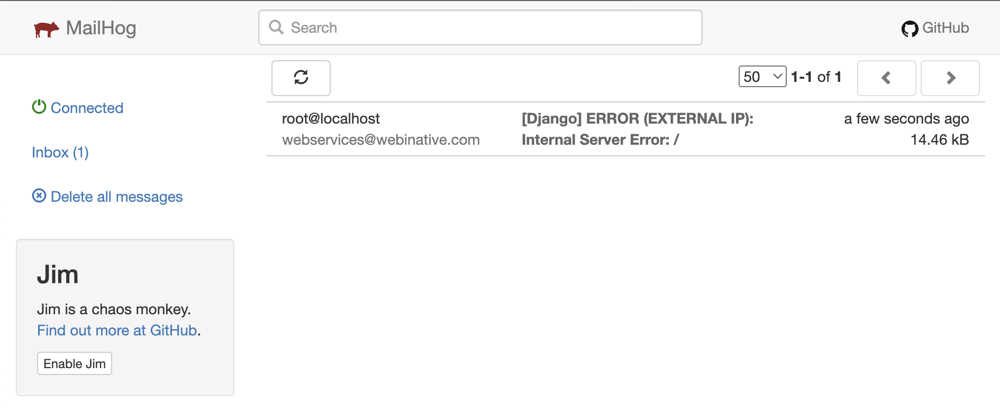

# Dockerise a Django application - Part 7

Welcome to part 7 - the last in the series on how we dockerise Django projects at Webinative.

In this article, we will focus on handling emails. As web application developers, we engineer apps that rely on emails for signing up, logging in, and sending OTPs, notifications and reminders.

Some teams use their SMTP provider (like SendGrid and MailJet) to test their emails. However, this approach is risky as someone might accidentally send test emails to actual customers.

We looked for solutions that separate development, testing and production environments without code changes. And we found Mailhog – a simple SMTP server that integrates with any Django app with mere configuration changes.

Let's dive in.

## Define a Mailhog service

Let's define a new Mailhog service below the `dockerise-django` section in the `docker-compose.yml` file.

```yaml
version: '3'

services:
  dockerise-postgres:
    # ...

  dockerise-django:
    # ...

  dockerise-mailhog:
     image: mailhog/mailhog
     container_name: dockerise-mailhog
     logging:
       driver: 'none' # disable saving logs
     ports:
       - 8025:8025 # web ui
     expose:
       - 1025

volumes:
  # ...
```

1. We use the official `mailhog/mailhog` docker image.
2. We bind our host machine to port 8025 to access the webmail view from our browser.
3. We also expose port 1025 so that the other services (Django and Postgres) can connect to Mailhog.

## Configure settings and ENV vars

Let's define the basic settings required to interface with any SMTP server in our project's `settings.py` file.

```python
# Email settings
 DEFAULT_FROM_EMAIL = os.getenv("DJANGO_DEFAULT_FROM_EMAIL", "webmaster@localhost")
 EMAIL_HOST = os.getenv("DJANGO_EMAIL_HOST")
 EMAIL_HOST_PASSWORD = os.getenv("DJANGO_EMAIL_HOST_PASSWORD")
 EMAIL_HOST_USER = os.getenv("DJANGO_EMAIL_HOST_USER")
 EMAIL_PORT = os.getenv("DJANGO_EMAIL_PORT")
 EMAIL_USE_TLS = os.getenv("DJANGO_EMAIL_USE_TLS")
```

Next, add these ENV variables in the `dockerise-django.env` file,

```ini
# DJANGO_DEFAULT_FROM_EMAIL=
DJANGO_EMAIL_HOST=dockerise-mailhog
# DJANGO_EMAIL_HOST_PASSWORD=
# DJANGO_EMAIL_HOST_USER=
DJANGO_EMAIL_PORT=1025
# DJANGO_EMAIL_USE_TLS=
```

**Note:** Mailhog, by default, does NOT require a username, password or TLS setting.

Let's provision the mailhog container by running,

```sh
docker-compose up -d

# verify the status of dockerise-mailhog service to be "running"
docker-compose ps
```

## Send a test email

Access the Django shell using the command,

```sh
docker-compose exec dockerise-django ./manage.py shell
```

Once inside the Django shell, send a test email,

```python
from django.core.mail import send_mail

send_mail('Test mail', 'Mail message goes here', None, ['to@example.com'])
```

Go to [http://localhost:8025/](http://localhost:8025/) in your browser, and you should see the test mail we just sent.


## Bonus tip

**Did you know?**

You can configure Django to send you emails about unhandled exceptions (those resulting in HTTP 500 errors) with a complete stack trace. This error reporting is helpful in LIVE (or production) environments with `DEBUG` set to `False`.

Add these additional settings to your project.

```python
# Error reporting through email
ADMINS = [
    ("Webservices", "webservices@webinative.com"),
]
SERVER_EMAIL = os.getenv("DJANGO_SERVER_EMAIL", "root@localhost")
```

- `ADMINS` - email addresses to whom the errors should be reported (TO addresses).
- `SERVER_EMAIL` - email address of the server reporting the error (FROM address).

### Testing the setup

Let us modify our view to raise an exception intentionally,

```python
# core/views.py

def home(request):
    if request.GET.get('trigger_500'):
        1000 / 0    # raise an exception to test error-reporting

    return render(request, "core/home.html")
```

Django reports errors through email only from environments with `DEBUG` set to `False`. Remove or comment the "`DJANGO_DEBUG=True`" line in the `dockerise-django.env` file.

Recreate the containers,

```sh
docker-compose up -d
```

Visit [http://localhost:8000/?trigger_500=true](http://localhost:8000/?trigger_500=true). You should see a blank 500 error page, as shown below.


Switch to the [Mailhog tab](http://localhost:8025/) and refresh. You should see the error email.




## Finishing up

Here we are at the end of this seven-part series.

In this article, we set up a mailhog SMTP service (container) and sent an email from Django programmatically. We also configured our Django app to send emails from production servers in case of 500 errors.

All changes described in this article have been committed to the GitHub branch "`part_07/mailhog`" of [this repository](https://github.com/Webinative/dockerise-django).

Like this article? Have a comment to share or a question to raise? Join our [Discord server](https://discord.gg/DfwgnNHd4k).
